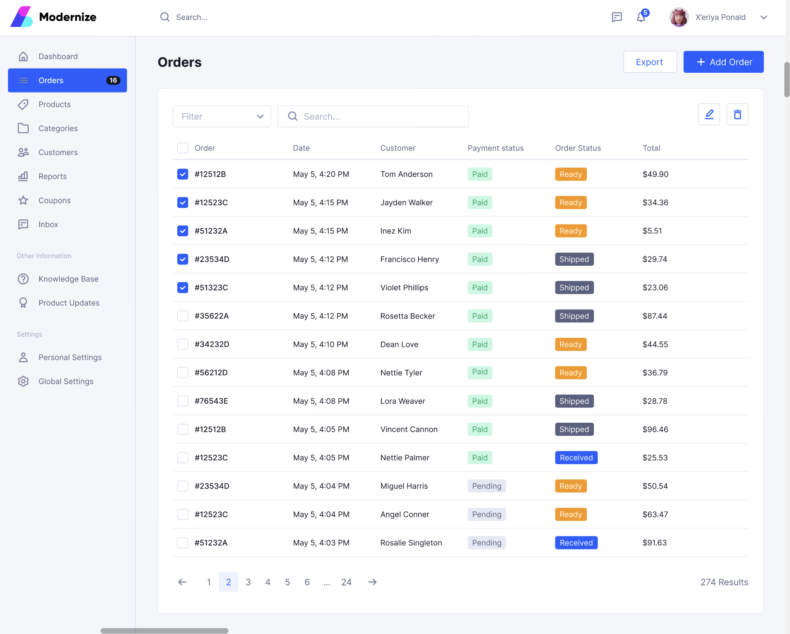

# Orders Dashboard - Angular Application
This project is a standalone Angular application that implements a single-page Orders Dashboard, based on a provided Figma design. It includes custom-styled components that replicate the look and feel of the design.

## Component Prototype



## Getting Started

### Prerequisites

- [Node.js](https://nodejs.org/)
- Angular CLI: `npm install -g @angular/cli`
- Angular Material

### Installation

1. Clone the repository
   ```sh
   git clone https://github.com/Icy-cui/Greenbase-modernize.git
2. Navigate to the project directory if not already there
    ```sh
    cd Greenbase-modernize
4. Install NPM packages
    ```sh
    npm install
5. Run the development server
   ```sh
   ng serve
6. Start the server at: `http://localhost:4200/`

## Code Structure
`src/app/`: Main application folder.

​    `components/`: Angular components for each part of the page.

​    `services/`: Angular services for data management and API calls.

​    `models/`: TypeScript models/interfaces.

​    `styles/`: SCSS files for styling components as per Figma design.


## Contact
**Icy Cui** - yunfei.icy@gmail.com

## Acknowledgements
[Angular](https://angular.io)
[Node.js](https://nodejs.org)
Design inspired by [Figma Design](https://www.figma.com
)